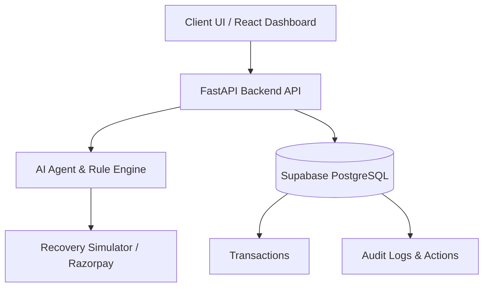

# RecoverAI - Autonomous AI Payment Recovery Platform

RecoverAI is an AI-powered revenue recovery agent that detects failed payments, predicts recovery potential, recommends safe recovery actions, and tracks recovered revenue using AI, FastAPI, React, Supabase, and Razorpay Test Mode.
## Project Title
RecoverAI

## Problem Statement
Businesses lose significant revenue to failed payments caused by temporary network issues, bank timeouts, expired cards, or insufficient funds. Traditional payment gateways offer rudimentary retry logic without analyzing the context of the failure, leading to lost customers and revenue.

## Solution
RecoverAI is an autonomous AI-driven payment recovery platform. It uses machine learning to analyze failed transactions, classify the failure reason, predict the probability of recovery, and autonomously execute the optimal recovery action (e.g., smart retry, generating payment links, sending reminders, or escalating to humans).

## Key Features
- **AI Decision Engine:** Analyzes failed transactions to determine the optimal recovery strategy.
- **Smart Retries:** Automatically retries transactions during temporary bank/network faults when recovery probability is high.
- **Automated Communication:** Generates Razorpay payment links and sends reminders for issues requiring customer action.
- **Deterministic Simulator:** Simulates execution outcomes without charging real money during test/sandbox phases.
- **Strict Safety Bounds:** Overrides AI decisions for high-value transactions, suspected fraud, or exceeded retry limits.
- **Comprehensive Analytics Dashboard:** Tracks revenue at risk, recovered revenue, and recovery success rates in real-time.
- **Immutable Audit Logging:** Logs all AI decisions and execution results for compliance and transparency.

## Architecture

## Technology Stack
- **Frontend:** React, TypeScript, Vite, Tailwind CSS, Recharts, Lucide React
- **Backend:** Python, FastAPI, SQLAlchemy, Uvicorn
- **Database:** PostgreSQL (Supabase) with connection pooling (`pool_pre_ping`)
- **Simulation:** Deterministic Razorpay Sandbox integration

## AI Workflow
1. **Trigger:** Failed payment is detected.
2. **Analysis:** The AI agent analyzes the failure code, amount, and history.
3. **Classification:** Determines if it's a temporary fault (Retry), credential issue (Payment Link), or requires review (Escalate).
4. **Scoring:** Calculates a Risk Score and Recovery Probability.
5. **Recommendation:** Suggests an action.
6. **Safety Enforcement:** The Rule Engine intercepts the recommendation to enforce hard limits.
7. **Execution:** The action is simulated/executed, and revenue states are updated.

## Safety Controls
- **Maximum Retries:** Capped at 3 retries per transaction.
- **High-Value Escalation:** Any transaction >= ₹20,000 is strictly routed to human review.
- **Fraud Prevention:** Any `fraud_flag` immediately escalates the transaction.

## Database Design
- `transactions`: Core payment records.
- `risk_scores`: Stored AI analysis results.
- `recovery_actions`: Execution logs and recovered amounts.
- `audit_logs`: Immutable tracking of system decisions.

## Setup Instructions
1. Clone the repository.
2. Navigate to `backend/` and run `pip install -r requirements.txt`.
3. Navigate to `frontend/` and run `npm install`.
4. Configure environment variables (see below).
5. Start backend: `python -m uvicorn app.main:app --host 0.0.0.0 --port 8000`.
6. Start frontend: `npm run dev`.

## Environment Variables
See `.env.example` in both directories.
**Backend:**
- `DATABASE_URL` (PostgreSQL URI)
- `MAX_RETRIES`, `HUMAN_ESCALATION_THRESHOLD`
**Frontend:**
- `VITE_API_BASE_URL` (Backend API URL)

## Demo Instructions
1. Open the Dashboard.
2. Observe Total Revenue, Failed Payments, and Revenue at Risk.
3. Navigate to Transactions and select a Failed payment.
4. Click **Analyze with AI**.
5. Review the AI's diagnosis, probability, and recommended action.
6. Click **Execute Recovery** to run the simulator.
7. Observe the transaction status change to `RECOVERED` and the Recovered Revenue metrics update.

## Screenshots
*(Insert screenshots of Dashboard, AI Analysis Modal, and Audit Logs here)*

## Future Scope
- Integration with real Razorpay production endpoints.
- SMS and WhatsApp integration for Payment Links.
- Enhanced Machine Learning models based on historical recovery data.
